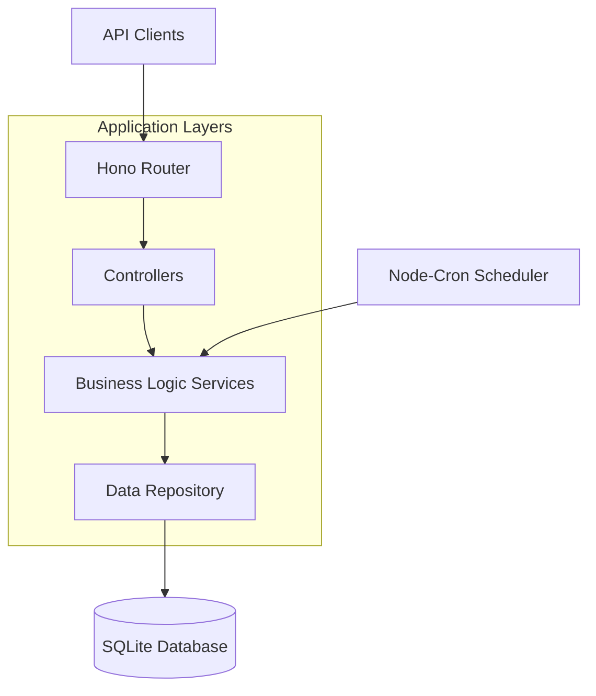

# Design Document

## Overview

The NodeSeeker port will be implemented as a RESTful API service using Hono.js framework running on Bun runtime. The service will provide node discovery and monitoring capabilities with persistent storage using SQLite. The architecture follows a layered approach with clear separation between API routes, business logic, and data access layers.

## Architecture



### Technology Stack
- **Runtime**: Bun
- **Web Framework**: Hono.js
- **Database**: SQLite with better-sqlite3 driver
- **Scheduling**: node-cron
- **Validation**: Zod (to be added)
- **Logging**: Built-in console with structured logging

## Components and Interfaces

### 1. API Routes Layer
**File**: `src/routes/nodes.ts`
- Handles HTTP requests and responses
- Input validation and sanitization
- Error handling and status code management
- Route definitions for CRUD operations

**Endpoints**:
- `POST /api/nodes` - Register a new node
- `GET /api/nodes` - List nodes with optional filtering
- `GET /api/nodes/:id` - Get specific node details
- `PUT /api/nodes/:id/health` - Update node health status
- `DELETE /api/nodes/:id` - Remove a node

### 2. Controller Layer
**File**: `src/controllers/nodeController.ts`
- Orchestrates business logic
- Handles request/response transformation
- Manages validation and error responses

### 3. Service Layer
**File**: `src/services/nodeService.ts`
- Core business logic implementation
- Node lifecycle management
- Health status tracking
- Query filtering and sorting

### 4. Repository Layer
**File**: `src/repositories/nodeRepository.ts`
- Database abstraction layer
- CRUD operations
- Query building and execution
- Transaction management

### 5. Database Schema
**File**: `src/database/schema.sql`

```sql
CREATE TABLE IF NOT EXISTS nodes (
    id TEXT PRIMARY KEY,
    name TEXT NOT NULL,
    type TEXT NOT NULL,
    url TEXT,
    region TEXT,
    status TEXT DEFAULT 'active',
    health_data TEXT, -- JSON string for flexible health metrics
    created_at DATETIME DEFAULT CURRENT_TIMESTAMP,
    updated_at DATETIME DEFAULT CURRENT_TIMESTAMP,
    last_seen DATETIME DEFAULT CURRENT_TIMESTAMP
);

CREATE INDEX idx_nodes_type ON nodes(type);
CREATE INDEX idx_nodes_status ON nodes(status);
CREATE INDEX idx_nodes_region ON nodes(region);
CREATE INDEX idx_nodes_last_seen ON nodes(last_seen);
```

### 6. Scheduled Tasks
**File**: `src/jobs/cleanupJob.ts`
- Automated cleanup of stale nodes
- Configurable retention periods
- Logging and monitoring

## Data Models

### Node Model
```typescript
interface Node {
  id: string;
  name: string;
  type: string;
  url?: string;
  region?: string;
  status: 'active' | 'inactive' | 'maintenance';
  healthData?: Record<string, any>;
  createdAt: Date;
  updatedAt: Date;
  lastSeen: Date;
}
```

### Health Check Model
```typescript
interface HealthCheck {
  nodeId: string;
  status: 'healthy' | 'unhealthy' | 'degraded';
  metrics?: {
    cpu?: number;
    memory?: number;
    responseTime?: number;
    [key: string]: any;
  };
  timestamp: Date;
}
```

### Query Parameters
```typescript
interface NodeQuery {
  type?: string;
  status?: string;
  region?: string;
  limit?: number;
  offset?: number;
}
```

## Error Handling

### Error Response Format
```typescript
interface ErrorResponse {
  error: {
    code: string;
    message: string;
    details?: any;
  };
  timestamp: string;
}
```

### Error Categories
1. **Validation Errors** (400): Invalid input data
2. **Not Found Errors** (404): Resource doesn't exist
3. **Conflict Errors** (409): Duplicate node registration
4. **Server Errors** (500): Database or system failures

### Error Middleware
- Global error handler for unhandled exceptions
- Structured error logging
- Consistent error response format

## Testing Strategy

### Unit Tests
- Service layer business logic
- Repository layer database operations
- Utility functions and helpers

### Integration Tests
- API endpoint testing
- Database integration testing
- Cron job execution testing

### Test Structure
```
tests/
├── unit/
│   ├── services/
│   ├── repositories/
│   └── utils/
├── integration/
│   ├── api/
│   └── database/
└── fixtures/
    └── testData.ts
```

### Testing Tools
- Bun's built-in test runner
- Supertest for API testing
- In-memory SQLite for test isolation

## Configuration Management

### Environment Variables
```typescript
interface Config {
  PORT: number;
  DATABASE_PATH: string;
  NODE_CLEANUP_INTERVAL: string; // cron expression
  NODE_TIMEOUT_MINUTES: number;
  LOG_LEVEL: string;
}
```

### Configuration Files
- `src/config/database.ts` - Database configuration
- `src/config/server.ts` - Server configuration
- `src/config/jobs.ts` - Cron job configuration

## Database Management

### Migration Strategy
- SQL migration files in `src/database/migrations/`
- Version-controlled schema changes
- Automatic migration on startup

### Connection Management
- Single SQLite connection with WAL mode
- Connection pooling not needed for SQLite
- Graceful shutdown handling

## Performance Considerations

### Database Optimization
- Proper indexing on frequently queried columns
- Query optimization for large datasets
- Pagination for list endpoints

### Caching Strategy
- In-memory caching for frequently accessed data
- Cache invalidation on data updates
- TTL-based cache expiration

### Monitoring
- Request/response logging
- Database query performance tracking
- Health check endpoint for service monitoring